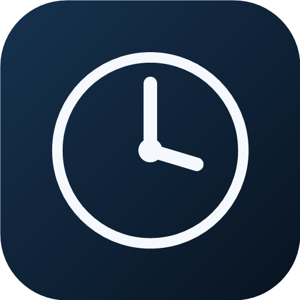
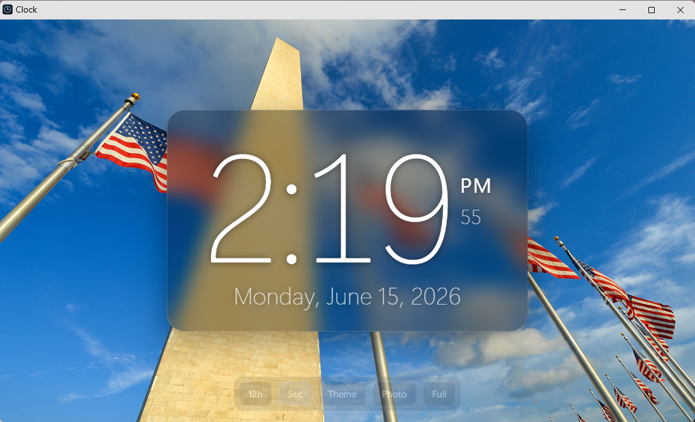

<div align="center">



# Clock

**A clean, modern desktop clock for Windows — with a fresh, bright wallpaper every day.**
Lightweight, ad-free, fully local, and dependency-free.


<br/>



</div>

---

A tiny, self-contained desktop clock that looks great and gets out of your way. It opens in
its own chromeless window, always in the same spot, and shows a crisp time over a fresh
photo each day — readable on any background thanks to a frosted glass card behind the
numbers. No ads, no accounts, no telemetry, no install bloat.

> Inspired by the look of apps like *Alarm Clock HD*, rebuilt from scratch as something
> small you fully own — just HTML, CSS, and JavaScript, with a couple of tiny Windows
> scripts to launch and update it.

## ✨ Features

- 🕒 **Elegant, legible face** — thin modern digits, AM/PM and seconds to the side, full date below
- 🪟 **Frosted glass card** keeps the numbers crisp white over *any* background
- 🌄 **A new background every day** — auto-downloaded from Bing's photo-of-the-day and
  auto-picked for brightness & vividness
- 📌 **Always opens in the same place & size** — pinned via its own Edge profile
- 🎨 **Themes** — cycle the daily photo and five built-in gradients, or drop in your own photo
- ⏱️ **12/24-hour** and **show/hide seconds** toggles
- 🖥️ **Chromeless window** — no tabs, no address bar; double-click or press <kbd>F</kbd> for fullscreen
- 🔌 **Works offline** and keeps the last photo when there's no internet
- 🪶 **Zero dependencies** — needs only Microsoft Edge, which ships with Windows
- 🚫 **Private** — everything runs locally; no ads, accounts, or tracking

## 🚀 Quick start

> **Requirements:** Windows 10/11 with Microsoft Edge. That's it — no Python, Node, or admin rights.

1. **Download** this folder onto your PC (anywhere).
2. **Double-click `install.bat`.**
3. Answer three quick questions — where it should sit, launch-at-login, and daily photos.

You'll get a **Clock** shortcut on your Desktop. Open it and you're done. 🎉

<details>
<summary>Prefer not to install? Just run it.</summary>

Double-click `start.bat` to serve the clock at `http://localhost:8080/` in your normal
browser, then press <kbd>F</kbd> for fullscreen. (Installing is recommended — it gives you
the chromeless, fixed-position window.)
</details>

## ⚙️ Configuration

### Move or resize the window
Edit **`window.cfg`** — four lines: `X`, `Y`, `Width`, `Height` (screen pixels) — then
relaunch. Or just re-run `install.bat` and pick a placement preset.

### Daily backgrounds
A fresh photo lands in `images/today.jpg` automatically:

- **Refreshes** at login, every day at **6:30 AM** (a Windows scheduled task), at local
  midnight, and whenever you focus the window.
- **Smart pick** — it scores Bing's last ~8 wallpapers for brightness and color and keeps the most vivid.
- **Get one now:** `powershell -ExecutionPolicy Bypass -File update-background.ps1 -Force`
- **Don't want photos?** Click **Theme** to switch to a gradient — it sticks.

### Themes & your own photo
Use the on-screen controls (move the mouse to reveal them): **Theme** cycles daily-photo →
gradients, **Photo** loads your own image, plus **12h/24h**, **Sec**, and **Full**.

## 🧠 How it works

No framework, no build step. The clock is a plain web page; a few small scripts make it
feel like a native app:

| Piece | Role |
|------|------|
| **Web app** (`index.html` · `style.css` · `app.js`) | The clock UI and logic |
| **`server.ps1`** | A ~60-line dependency-free static server on `127.0.0.1:8080` (no Python/Node) |
| **`clock.vbs`** | Launches Edge in *app mode* in a dedicated profile, so window position & size are pinned every time — and runs with no visible console |
| **`sw.js`** | Service worker for offline use |
| **`update-background.ps1`** | Downloads & scores the daily photo |

Because the clock runs in its **own Edge profile**, the `--window-position`/`--window-size`
flags are honored on every launch — that's the trick that keeps it from ever drifting.

## 📁 Project structure

```
FreeGoodLookingClock/
├─ install.bat / install.ps1      ← setup wizard
├─ uninstall.bat / uninstall.ps1  ← clean removal
├─ clock.vbs                      ← everyday launcher (chromeless, fixed position)
├─ window.cfg                     ← window X / Y / W / H
├─ server.ps1                     ← tiny local server (no dependencies)
├─ update-background.ps1          ← daily photo downloader + scorer
├─ index.html · style.css · app.js
├─ manifest.webmanifest · sw.js   ← PWA metadata + offline cache
├─ icons/                         ← app icons
└─ images/today.jpg               ← current background (overwritten daily)
```

## 🗑️ Uninstall

**Double-click `uninstall.bat`.** It stops the clock and server, removes the Desktop &
Startup shortcuts, removes the daily task, and deletes the Edge profile — then leaves the
folder for you to delete. Run `uninstall.ps1 -DryRun` first to preview, or `-KeepProfile`
to keep your settings.

## 🛠️ Built with

Plain **HTML · CSS · JavaScript**, a **PowerShell** micro-server, and a **VBScript**
launcher. No frameworks, no bundler, no `node_modules`.

## 📄 License

[MIT](LICENSE) © 2026 Jason Perr — do whatever you like; attribution appreciated.
